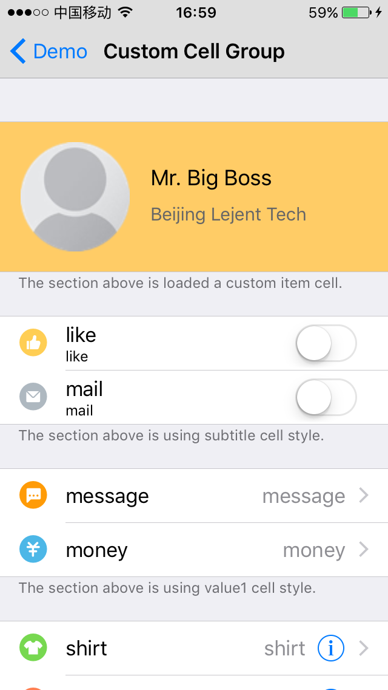

# YJGroupedStyleTableViewController

[](https://travis-ci.org/huang-kun/YJGroupedStyleTableViewController)
[](http://cocoapods.org/pods/YJGroupedStyleTableViewController)
[](http://cocoapods.org/pods/YJGroupedStyleTableViewController)
[](http://cocoapods.org/pods/YJGroupedStyleTableViewController)

## Example

Just create a subclass of YJGroupedStyleTableViewController. With very little code, you can easily create a customized group-style table view.

This is a default style which is the same as iOS Settings App style.


<br>

This is another demo style with all custom background colors and heights for cells, sections and separators. The table view also include a registered header class.


<br>

This is another demo style with different cell style for each section, specified text for section footers. The demo also include a registered custom cell class.




<br>

## Requirements

iOS 6+, ARC.

## Installation

YJGroupedStyleTableViewController is available through [CocoaPods](http://cocoapods.org). To install
it, simply add the following line to your Podfile:

```ruby
pod "YJGroupedStyleTableViewController"
```

## Author

huang-kun, jack-huang-developer@foxmail.com

## License

YJGroupedStyleTableViewController is available under the MIT license. See the LICENSE file for more info.
